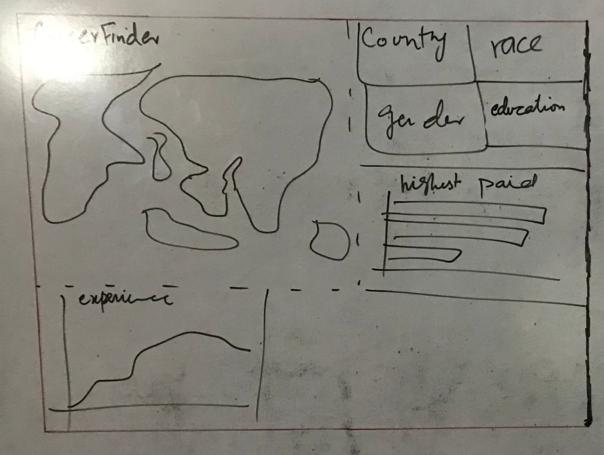
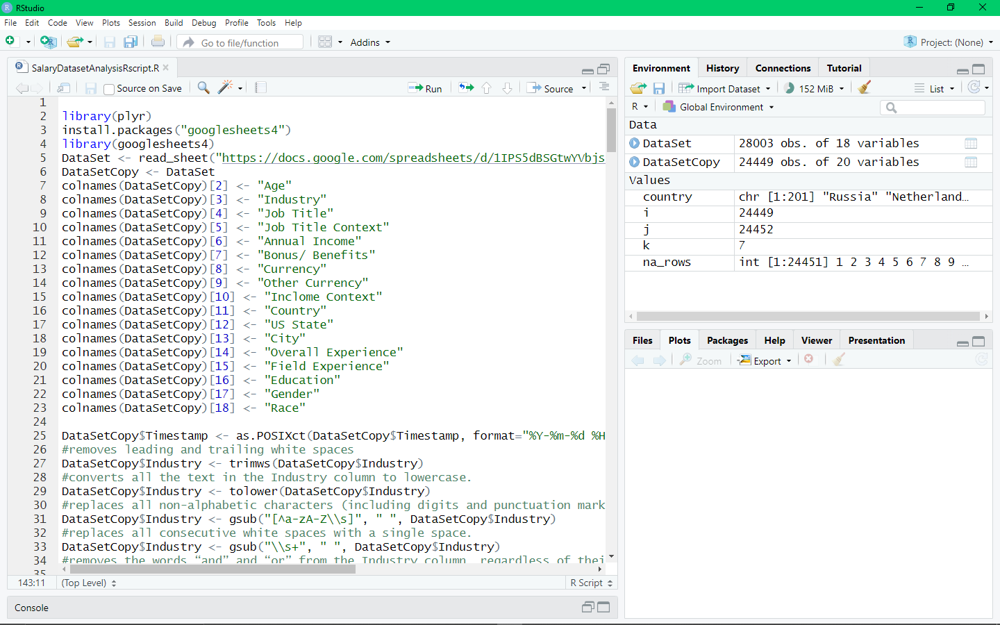
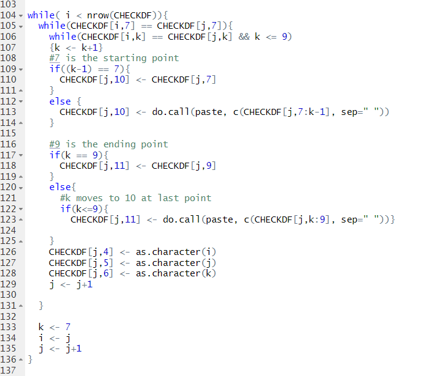

# Salary Dataset Analysis
## Table of contents :clipboard:
1. [Introduction](https://github.com/masudsajid/Salary-Dataset-Analysis/blob/main/README.md#introduction)
3. [Understanding the dataset](https://github.com/masudsajid/Salary-Dataset-Analysis/blob/main/README.md#understanding-the-dataset)
4. [Problem statement](https://github.com/masudsajid/Salary-Dataset-Analysis/blob/main/README.md#problem-statement)
5. [Skill/ concepts demonstrated](https://github.com/masudsajid/Salary-Dataset-Analysis/blob/main/README.md#skill//-concepts-demonstrated)
6. [Modelling](https://github.com/masudsajid/Salary-Dataset-Analysis/blob/main/README.md#modelling)
7. [Data cleaning in RStudio](https://github.com/masudsajid/Salary-Dataset-Analysis/blob/main/README.md#data-cleaning-in-rstudio)
8. [Power BI Dashboard](https://github.com/masudsajid/Salary-Dataset-Analysis/blob/main/README.md#power-bi-dashboard)

## Introduction
It’s hard to get real-world information about what jobs pay. Online salary websites are often inaccurate, and people can get weird when you ask them directly.
So let’s take some of the mystery out of salaries. The data is a Salary Survey from _AskAManager.org_. It’s US-centric-ish but does allow for a range of country inputs.

## Understanding the dataset
- There are 17 variables
- 6 of the variables are free-form text entry, which always results in lots of data cleaning to be done!
- The dataset is “live” and constantly growing.
- When downloading the dataset, there’s also a “timestamp” variable (column A), so you can simulate a growing list by filtering data by longer and longer timespans if it’s no longer receiving any updates.

## Problem statement
1. Which industry pays the most?
2. How does salary increase given years of experience?
3. How do salaries compare for the same role in different locations?
4. How much do salaries differ by gender and years of experience?
5. How do factors like race and education level correlate with salary?
6. Is there a “sweet spot” total work experience vs years in the specific field?

## Skill/ concepts demonstrated
- Power BI
- RStudio
- Data Cleaning
- Buttons
- Modelling
- Navigation
- Data Manipulation
- Interactive Dashboard

## Modelling
Before gettings my hands into the data, I like to create a prototype of how the final dashboard should look like. This helps in navigating through the project. The data had a _country_ column so I instantly thought of integrating map in the dashboard. Users can filter the visuals by _country_.

## Data cleaning in RStudio

First action was to pull data from the live google form. I took the following steps to make the dataset analysable:
- Typecasting
- Removing null rows
- Due to ree text option in _Industry_ column, same industry name was mention in different ways like _library_, _libraries_ or _Ed Tech_, _edtech_. To eliminate this problem, I designed the following algorithm in R:
  - made 6 new columns, _word1_, _word2_, _word3_, _word4_, _category_ and _subcategory_ (the max number of words in a row was 4)
  - sort the dataset by _industry_, A-Z
  - make all values in lowercase
  - remove all characters other than alphabets
  - separate all words based on space and put all individual words in _word1_ to _word4_ columns
  - made 2 new variables, _i_ and _j_ for 2 loops
  - _i_ is the row number of the first new discovered value (in industry column), and _j_ starts from just below it. The variable _k_ check till where the words are same, then from _word1_ to _k_ is concatenated and put into _category_ column and the rest into _subcategory_
  
- Made all values in _country_ column into "USA" where _state_ was not null.
- Some other countries were also written in different fomrs like _UK_, _united Kingdom_ etc. These names were handled manually.
- Rows were removed where the currency was other. This was done to keep only the most used currency rows which would make it easier to covert into a single metric (USD).
- Some _income_ values were very unrealistic. To remove such rows, a new column _standard deviation_ was made. The rows were filtered out where value is more than 3 times the _standard deviation_.

## Power BI Dashboard
After data cleaning, it was time to present the insights. I added multiple charts which showed trends of salary in different countries. I limited the row count of each variable in charts to be more than or equal to 15. This ensured that the analysis was not effected by outliers.

